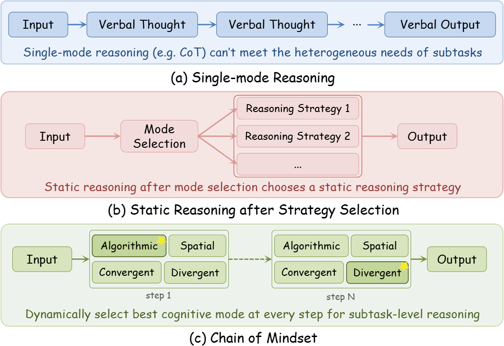
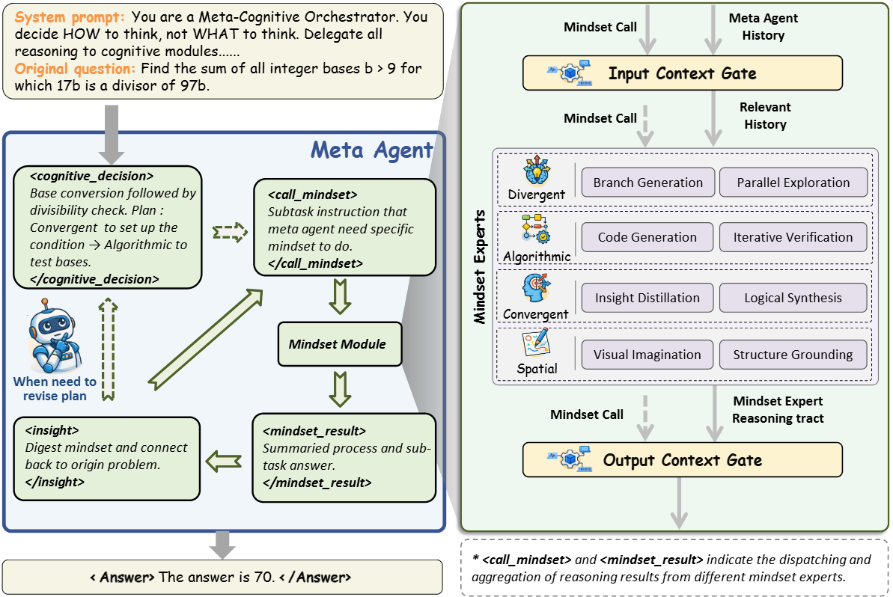

<h1 align="center">🧠 Chain of Mindset: Reasoning with Adaptive Cognitive Modes</h1>

<div align="center"> 

[](https://arxiv.org/abs/2602.10063) 
[](https://opensource.org/licenses/MIT) 
[](https://www.python.org/downloads/release/python-390/) 

</div>

<h5 align="center"> If you like our project, please give us a star ⭐ on GitHub for the latest update.</h5>

## 📣 Latest News

- **02/11/2026**: 🎉 The code for Chain-of-Mindset has been released! You can now apply CoM to enhance your LLM reasoning.

## 💡 Overview

Human problem-solving is never the repetition of a single mindset. When tackling a complex task, we do not rely on a single cognitive mode; instead, we dynamically switch between different mindsets as the problem state evolves. However, existing LLM reasoning methods fall into a common trap: **they apply the same fixed mindset across all steps**, overlooking that different stages of solving the same problem require fundamentally different cognitive approaches.

<p align="center">
  
</p>

### ✨ The Meta-Cognition Gap

Humans make cognitive decisions in milliseconds—unconsciously switching between calculation, visualization, exploration, and focused analysis. LLMs cannot do this implicitly. **Chain-of-Mindset (CoM) bridges this gap** by providing an explicit framework for step-level adaptive mindset orchestration.

### ✨ Key Innovation

Unlike previous methods that are limited to a single mindset or select a strategy only at task onset, CoM enables **dynamic, state-dependent cognitive switching**—recognizing when to transition between mindsets based on the progress of reasoning.

<p align="center">
  
</p>

**Framework Architecture:**
- **Meta-Agent**: Operates as a meta-cognitive orchestrator, iteratively generating cognitive decisions, dispatching subtasks to specialized mindsets, and internalizing key insights.
- **Four Heterogeneous Mindsets**: Divergent, Algorithmic, Convergent, and Spatial—each providing distinct cognitive capabilities.
- **Bidirectional Context Gate**: Mediates information flow between modules, filtering relevant history for mindset execution and distilling verbose traces into concise results.

## 🧠 The Four Cognitive Mindsets

| Mindset&nbsp;&nbsp;&nbsp;&nbsp;&nbsp;&nbsp;&nbsp;&nbsp;&nbsp;&nbsp;&nbsp;&nbsp;&nbsp;&nbsp;&nbsp;&nbsp; | Trigger | Cognitive Shift | When to Use |
|:----------------------|---------|-----------------|-------------|
| **💻 Algorithmic** | `<call_algorithmic>` | Estimation → Precise Verification | Hypothesis needs objective verification through code execution |
| **🖼️ Spatial** | `<call_spatial>` | Verbal → Visual-Spatial Representation | Problem has geometric structure or benefits from visualization |
| **🌳 Divergent** | `<call_divergent>` | Convergent → Parallel Exploration | Uncertain which approach is correct; need to explore multiple paths |
| **🔍 Convergent** | `<call_convergent>` | Scattered → Deep Focused Analysis | Need to reason deeply through one specific logical thread |

## 🔧 Installation

### 1. Environment Setup

```bash
# Clone the repository
git clone https://github.com/QuantaAlpha/chain-of-mindset.git
cd chain-of-mindset

# Create conda environment
conda create -n com python=3.9
conda activate com

# Install requirements
pip install -r requirements.txt
```

### 2. Configure API Keys

Edit the config files in `configs/` directory:

```bash
cd configs

# For API mode (OpenAI, Azure, OpenRouter, etc.)
# Edit: meta_llm_config_api.json, mindset_llm_config_api.json, gate_config_api.json

# For Local mode (vLLM, Ollama, etc.)
# Edit: meta_llm_config_local.json, mindset_llm_config_local.json, gate_config_local.json
```

See [configs/README.md](configs/README.md) for detailed configuration options.

## 🚀 Quick Start

### API Mode (OpenAI, Azure, OpenRouter, etc.)

```bash
# Run with default query
python main_api.py

# Run with custom query
python main_api.py --query "A train leaves Station A at 80 km/h. Two hours later, another train leaves at 120 km/h in the same direction. When does the second train catch up?"

# With image input
python main_api.py --query "Analyze this geometry problem" --images path/to/diagram.png
```

### Local Mode (vLLM, Ollama, etc.)

```bash
# Run with default query
python main_local.py

# Run with custom query
python main_local.py --query "Your question here"
```

### Without Spatial Mindset (Text-only)

For scenarios where image generation is not needed:

```bash
# API mode without Spatial mindset
python main_without_spatial.py --mode api --query "Your question here"

# Local mode without Spatial mindset
python main_without_spatial.py --mode local --query "Your question here"
```

### Parameters

| Parameter | Description | Default |
|-----------|-------------|---------|
| `--query` | The question to solve | Default test query |
| `--images` | Path to input images (optional) | None |
| `--meta_llm_conf` | Path to meta LLM config | `configs/meta_llm_config_*.json` |
| `--mindset_llm_conf` | Path to mindset LLM config | `configs/mindset_llm_config_*.json` |
| `--gate_conf` | Path to gate config | `configs/gate_config_*.json` |
| `--img_conf` | Path to image generation config | `configs/api_config_image.json` |

## � Output

All reasoning traces and generated images are saved to the `workspace/` directory, organized by session.

## �📁 Project Structure

```
chain-of-mindset/
├── main_api.py              # API mode entry point
├── main_local.py            # Local mode entry point
├── main_without_spatial.py  # Entry point without Spatial mindset
├── config.py                # Configuration management
│
├── core/
│   ├── orchestrator.py      # Meta-cognitive orchestrator
│   ├── llm_client.py        # LLM client wrapper
│   ├── gate.py              # Bidirectional context gate
│   ├── sandbox.py           # Code execution sandbox
│   ├── protocol.py          # Mindset token protocol
│   └── image_client.py      # Image generation client
│
├── paradigms/
│   ├── base.py              # Base paradigm class
│   ├── registry.py          # Paradigm registry
│   ├── convergent.py        # Convergent analysis mindset
│   ├── algorithmic/         # Algorithmic (code execution) mindset
│   ├── divergent/           # Divergent exploration mindset
│   └── spatial/             # Spatial visualization mindset
│
├── prompts/
│   └── system.py            # System prompts for meta-agent
│
├── utils/                   # Utility functions
├── configs/                 # Configuration files
└── assets/                  # Figures and images
```

## 💻 Code Execution (Algorithmic Mindset)

The Algorithmic mindset executes Python code through a **Generate → Execute → Fix → Retry** loop.

**Two execution modes:**
- **🐳 Docker Mode**: Auto-detected when Docker is available. Runs code in isolated container with auto-dependency installation.
- **💻 Local Mode**: Fallback when Docker unavailable. Runs in subprocess with basic security checks (no auto-install).

```bash
# Docker mode (recommended) - ensure Docker is running
docker --version
```


## 📄 Citation

If you find this work useful, please cite our paper:

```bibtex
@article{jiang2026chain,
  title = {Chain of Mindset: Reasoning with Adaptive Cognitive Modes},
  author = {Tianyi Jiang, Arctanx An, Hengyi Feng, Naixin Zhai, Haodong Li, Xiaomin Yu, Jiahui Liu, Hanwen Du, Shuo Zhang, Zhi Yang, Jie Huang, Yuhua Li, Yongxin Ni, Huacan Wang, Ronghao Chen},
  journal = {arXiv preprint arXiv:2602.10063},
  year = {2026}
}
```

## 📄 License

This project is released under the [MIT License](LICENSE).

## 📬 Contact

For any questions or feedback, please open an issue or reach out to us at [tianyijiang0219@gmail.com](mailto:tianyijiang0219@gmail.com).

## 🙏 Acknowledgments

- Inspired by cognitive science research on working memory and executive function
- The Algorithmic mindset implementation is based on [Chain of Code](https://arxiv.org/abs/2312.04474) (Li et al., 2023)
- Built on the OpenAI API specification for broad compatibility
- Thanks to the open-source community for foundational tools and models

## Star History

<a href="https://star-history.com/#QuantaAlpha/chain-of-mindset&Date">
 <picture>
   <source media="(prefers-color-scheme: dark)" srcset="https://api.star-history.com/svg?repos=QuantaAlpha/chain-of-mindset&type=Date&theme=dark" />
   <source media="(prefers-color-scheme: light)" srcset="https://api.star-history.com/svg?repos=QuantaAlpha/chain-of-mindset&type=Date" />
   
 </picture>
</a>
